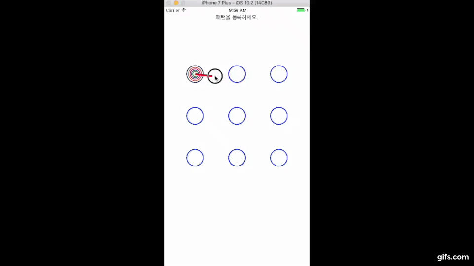

ios LockPattern Screen Sample



# LockPattern

## Usage

###Example usage: *.h

```objc
#import "LockScreen.h"

typedef enum {
    InfoStatusFirstTimeSetting = 0,
    InfoStatusConfirmSetting,
    InfoStatusFailedConfirm,
    InfoStatusNormal,
    InfoStatusFailedMatch,
    InfoStatusSuccessMatch
}	InfoStatus;

@property (strong, nonatomic) IBOutlet LockScreen *lockScreenView;
@property (nonatomic) InfoStatus infoLabelStatus;

```

###Example usage: *.m

```objc
@interface ViewController ()<LockScreenDelegate>

- (void)viewDidAppear:(BOOL)animated
{
    [super viewDidAppear:animated];
    
    self.lockScreenView = [[LockScreen alloc]initWithFrame:CGRectMake(0, 0, self.view.bounds.size.width, self.view.bounds.size.width)];
    self.lockScreenView.center = self.view.center;
    self.lockScreenView.delegate = self;
    self.lockScreenView.backgroundColor = [UIColor clearColor];
    [self.view addSubview:self.lockScreenView];
    
    [self updateOutlook];
    
}


- (void)updateOutlook
{
    switch (self.infoLabelStatus) {
        case InfoStatusFirstTimeSetting:
            self.infoLabel.text = @"패턴을 등록하세요.";
            break;
        case InfoStatusConfirmSetting:
            self.infoLabel.text = @"등록된 패턴을 확인해주세요.";
            break;
        case InfoStatusFailedConfirm:
            self.infoLabel.text = @"패턴확인이 실패 되었습니다. 다시 시도해 주세요.";
            break;
        case InfoStatusNormal:
            self.infoLabel.text = @"패턴을 인증해주세요.";
            break;
        case InfoStatusFailedMatch:
            //self.infoLabel.text = [NSString stringWithFormat:@"Wrong Guess # %d, try again !",self.wrongGuessCount];
            self.infoLabel.text = @"틀렸습니다. 다시 인증해주세요";
            break;
        case InfoStatusSuccessMatch:
            self.infoLabel.text = @"Welcome !";
            break;
            
        default:
            break;
    }
    
}


#pragma -LockScreenDelegate

- (void)lockScreen:(LockScreen *)lockScreen didEndPattern:(NSNumber *)patternNumber
{
    NSUserDefaults *stdDefault = [NSUserDefaults standardUserDefaults];
    switch (self.infoLabelStatus) {
        case InfoStatusFirstTimeSetting:
            [stdDefault setValue:patternNumber forKey:kCurrentPatternTemp];
            self.infoLabelStatus = InfoStatusConfirmSetting;
            [self updateOutlook];
            break;
        case InfoStatusFailedConfirm:
            [stdDefault setValue:patternNumber forKey:kCurrentPatternTemp];
            self.infoLabelStatus = InfoStatusConfirmSetting;
            [self updateOutlook];
            break;
        case InfoStatusConfirmSetting:
            if([patternNumber isEqualToNumber:[stdDefault valueForKey:kCurrentPatternTemp]]) {
                [stdDefault setValue:patternNumber forKey:kCurrentPattern];
                self.infoLabel.text = @"패턴이 인증되었습니다";
                self.infoLabelStatus = InfoStatusNormal;
            }
            else {
                if([NSString stringWithFormat:@"%@", [stdDefault valueForKey:kCurrentPattern]].length > 0) {
                    self.infoLabelStatus = InfoStatusFailedMatch;
                    [self updateOutlook];
                }else {
                    self.infoLabelStatus = InfoStatusFailedConfirm;
                    [self updateOutlook];
                }
            }
            break;
        case  InfoStatusNormal:
            if([patternNumber isEqualToNumber:[stdDefault valueForKey:kCurrentPattern]]) {
                self.infoLabel.text = @"패턴이 인증되었습니다";
                self.infoLabelStatus = InfoStatusNormal;
            }
            else {
                self.infoLabelStatus = InfoStatusFailedMatch;
                self.wrongGuessCount ++;
                [self updateOutlook];
            }
            break;
        case InfoStatusFailedMatch:
            if([patternNumber isEqualToNumber:[stdDefault valueForKey:kCurrentPattern]]) {
                self.infoLabel.text = @"패턴이 인증되었습니다";
                self.infoLabelStatus = InfoStatusNormal;
            }
            else {
                self.wrongGuessCount ++;
                self.infoLabelStatus = InfoStatusFailedMatch;
                [self updateOutlook];
            }
            break;
        case InfoStatusSuccessMatch:
            [self dismissViewControllerAnimated:YES completion:nil];
            break;
            
        default:
            break;
    }
}


```

## Author

minjoongkim, kmj6773@gmail.com

## License

PopupView is available under the MIT license. See the LICENSE file for more info.
